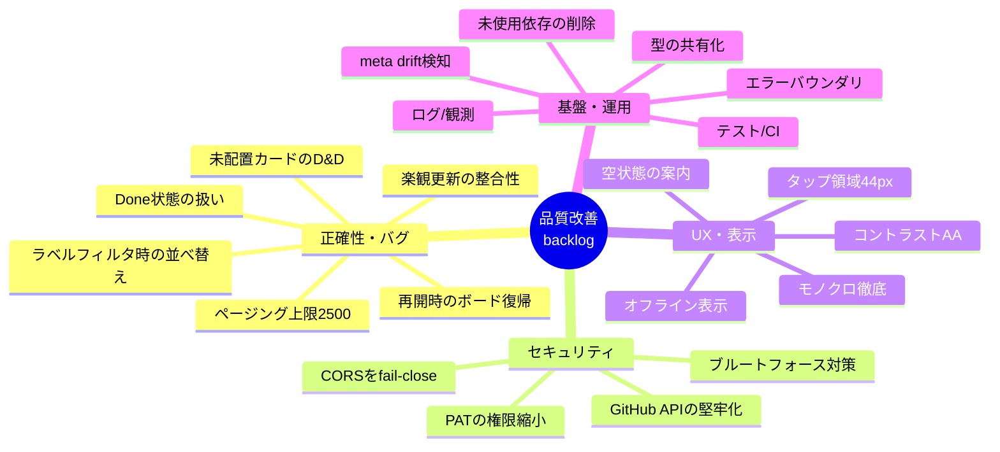

# life-task-pwa 品質改善ロードマップ

> コード全体を 4 観点（**セキュリティ / 正確性・バグ / UX・アクセシビリティ / 基盤・運用**）で監査し、改善項目を洗い出して整理したもの。
> 監査日: 2026-06-05 / 対象コミット: 0008283（モノクロテーマ + 最終アイコン）時点のソース。
>
> 現状評価: **設計は堅実**（owner/repo/project のハードコードで漏洩時の被害を 1 リポジトリに限定、合言葉は定数時間比較、楽観更新 + ロールバック、SW 更新フローと `_headers` キャッシュ、アイコン生成、tsconfig strict、`.env`/Secret 分離は良好）。以下は「より高品質にするための差分」であり、致命的な欠陥リストではない。
>
> **優先度の考え方**: 一般的な WCAG/ベスプラ基準ではなく **「単独ユーザー（自分）が iPhone で毎日使う」実態** に合わせて再評価している。例: スクリーンリーダ対応は基準上は P1 だが実務優先度は中、一方で「コントラスト」「タップ領域」は自分の使い勝手に直結するので実施推奨。

---

## 全体像

### 影響度 × 工数（実施判断の早見表）

| 優先 | 項目 | 影響 | 工数 | 区分 |
|---|---|---|---|---|
| P1 | 未使用依存（dnd-kit/sortable・utilities）削除 | 中 | 極小 | 基盤 |
| P1 | 楽観更新の整合性（surgical rollback + refresh 競合ガード） | 高 | 中 | バグ |
| P1 | ラベルフィルタ時の並べ替えアンカー不整合 | 高 | 小 | バグ |
| P1 | 未配置カードの D&D で itemId 不整合 | 中 | 小 | バグ |
| P1 | 合言葉のブルートフォース対策（レート制限） | 高 | 小〜中 | セキュ |
| P1 | CORS を fail-close（`*` 既定の撤廃） | 中 | 小 | セキュ |
| P1 | コントラスト AA 不足（薄い sub テキスト） | 中 | 小 | UX |
| P1 | タップ領域 44px 未満 + 密集 | 中 | 小 | UX |
| P1 | オフライン時の日本語メッセージ | 中 | 小 | UX |
| P1 | meta で ハードコード ID の drift 検知 | 中 | 小 | 基盤 |
| P2 | PAT を fine-grained / 専用アカウントへ | 高 | 中 | セキュ |
| P2 | GitHub API のタイムアウト/リトライ/レート処理 | 中 | 中 | セキュ |
| P2 | テスト（Worker 純粋ロジック）+ CI | 中 | 中 | 基盤 |
| P2 | React エラーバウンダリ | 中 | 小 | 基盤 |
| P2 | クイック追加の Status 表記（英語/Done 混入） | 中 | 小 | UX |
| P2 | モノクロ徹底（残存ブランド色） | 低 | 小 | UX |
| P2 | createTask 部分失敗での孤立 issue | 中 | 中 | バグ |
| P2 | Done 状態のカードを掴むと意図せず状態変更 | 中 | 小 | バグ |
| その他 | P3 群（下記） | 低 | 各小 | 横断 |

> **クイックウィン（まず 30 分で終わる束）**: 未使用依存削除 / CORS fail-close / コントラスト修正 / タップ領域拡大 / クイック追加の Status 表記。effort 極小〜小で体感品質が上がる。

---

## P1 — 優先度・高

### 正確性・バグ

#### [P1-B1] 楽観更新の整合性（ロールバックの全置換 + focus 再同期の競合）
- **ファイル**: `src/context/BoardContext.tsx`（`setStatus` / `setTaskLabels` / `setTaskState` / `moveTask` / `refresh`）
- **何が問題か**:
  1. 各楽観ハンドラは失敗時に `setTasks(prev)` で **配列全体を巻き戻す**。2 操作が重なると（例: カード A を In Progress にドラッグ → 返答前にカード B のラベルを変更）、先の操作が失敗したとき後の操作の確定変更まで巻き戻して**黙って消える**。
  2. `refresh()` が `focus`/`visibilitychange` のたびに無条件 `setTasks(tasks)` する（`BoardContext.tsx:75-102`）。モバイル PWA は復帰イベントが頻発（キーボード・共有シート・アプリ切替）するため、ドラッグ永続化中に復帰すると**進行中の楽観状態をサーバ値で上書き**し、その後の失敗で stale が復活し得る。
- **直し方**:
  - ロールバックを **該当 task だけの surgical 復元**（`number` 指定の関数型更新）に変更。配列全置換をやめる。
  - **in-flight カウンタ**を持ち、楽観操作が 1 つでも進行中なら `refresh()` をスキップ/遅延、または `number` 単位の reconcile に変える。
- **なぜ P1**: モバイルでは復帰イベントが日常的に起き、再現しやすい。データ消失/見た目の巻き戻りという「使っていて最も萎える」種類のバグ。

#### [P1-B2] ラベルフィルタ有効時、並べ替えのアンカーが「全件」基準でズレる
- **ファイル**: `src/pages/Board.tsx`（`onDragEnd:137-160`）
- **何が問題か**: フィルタ中は `board.byStatus[col]`（フィルタ後）で表示しているのに、列末尾へドロップしたときの `afterItemId` を `flat = board.tasks`（**全件**）から「その status の最後のカード」を走査して決めている（`:150-153`）。その「最後のカード」はフィルタで隠れているカードのことがあり、**見えていないカードの後ろ**に挿入される → 画面の並びと GitHub 上の実順が乖離し、リフレッシュでカードが飛ぶ。
- **直し方**: フィルタ有効時は **見えている列リストから直前カードを決めて実隣接へマップ**する。最小対応として、フィルタ中は「列内の並べ替え」を無効化し status 変更のみ許可する（精度が出ないなら割り切る）。
- **なぜ P1**: ラベルフィルタは普段使いの機能。使うと並べ替えが壊れるのは品質印象を大きく下げる。

#### [P1-B3] 未配置カード（itemId 空）の列跨ぎ D&D で itemId 不整合 → status だけ反映して見た目は巻き戻る
- **ファイル**: `src/context/BoardContext.tsx`（`moveTask:177-178`）/ `src/pages/Board.tsx`（`onDragEnd:161`）
- **何が問題か**: `moveTask` は `newStatus` があるとき `api.setStatus()`（Worker 側でボード追加 + **新しい itemId 採番**）→ 直後に `api.reorderTask(number, moved.itemId, ...)` を **ドラッグ開始時の古い空 itemId** で呼ぶ。`reorderTask` は空 itemId で「itemId が不正です」を投げ → 全体ロールバック。だが status 変更は既に GitHub に反映済み。結果、**画面は巻き戻るが GitHub は変わっている**デスクが残る。
- **発生条件**: 「まだボードに無い issue」をドラッグした場合（再開直後のカード等）。常時ではないが起きると確実にデスクる。
- **直し方**: `moveTask` で `api.setStatus` の返り値 `task.itemId` を受け取り、続く `reorderTask` とローカルキャッシュ更新にその新 itemId を使う。
- **関連**: [P2-B8]（再開時にボード復帰しない）と同根。

### セキュリティ

#### [P1-A1] 合言葉がブルートフォース可能（レート制限・ロックアウトなし）
- **ファイル**: `worker/src/index.ts`（`:18-21`、`:127-138`）/ `worker/.dev.vars.example:9`
- **何が問題か**: 認証は共有合言葉 1 つのみ。定数時間比較でタイミング漏れは防げているが、**回数制限・IP スロットル・失敗ロックアウト・バックオフが一切ない**。公開 `*.workers.dev` URL に総当たりでき、背後の PAT は Classic `repo`+`project`（広域）なので的中時の被害が大きい。
- **直し方**: `CF-Connecting-IP` をキーにしたレート制限（Cloudflare の Rate Limiting バインディング、または KV/Durable Object カウンタ）で「IP あたり 10 分で N 回失敗 → 429」。合言葉の最小長（24 文字以上のランダム）を README に明記。任意で Cloudflare WAF レート規則を Worker ルート前段に。
- **なぜ P1**: 単独ユーザーでも、認証が唯一の壁である以上、総当たり耐性ゼロは最大の穴。

#### [P1-A2] CORS が `*` フォールバック / 非許可 origin でも許可 origin をエコー
- **ファイル**: `worker/src/index.ts`（`corsHeaders:110-124`）/ `worker/wrangler.toml:11-15`
- **何が問題か**:
  1. `env.ALLOWED_ORIGIN` 未設定時の既定が `'*'`（`:112`）。本アプリは Cookie ではなく独自ヘッダ `X-App-Key` 認証なので `*` は実際に任意 origin からの読み書きを許す（合言葉が漏れ/保存されていれば）。README はこの設定を「任意・推奨」扱いにしている。
  2. allowlist 設定時でも、非一致 origin に対し拒否ではなく `allowed[0]` を返す（`:115`）。ブラウザ側で弾かれるので実害は薄いが、契約として紛らわしく拒否経路が無い。
- **直し方**: `'*'` 既定を撤廃し **fail-close**（未設定なら `Access-Control-Allow-Origin` を出さない）。allowlist 非一致時はヘッダを省く。README で `ALLOWED_ORIGIN` を**必須手順**に格上げ。
- **補足**: CORS はブラウザ強制のみ。非ブラウザ攻撃者（curl）には効かず、最終的な壁は合言葉＝[P1-A1] とセットで効く。

### UX・表示

#### [P1-C1] 薄い sub テキストが AA コントラストを下回る（屋外で読めない）
- **ファイル**: `src/components/TaskCardView.tsx:65`（`text-sub/70` = 3.45:1）/ `src/pages/TaskDetail.tsx:244`（`/60` = 2.88:1）/ `src/components/StatusColumn.tsx:62`・`CompletedColumn.tsx:30`（「なし」`/50` = 2.40:1）/ `src/components/ui/Input.tsx:9,25`（placeholder `/50`）/ `LabelManager.tsx:117`・`LabelQuickSheet.tsx:32`
- **何が問題か**: ベースの `--sub #8b949e` は十分（panel 上 5.6:1）だが、実テキストで `/70`〜`/50` に落としている箇所が多く、12px 前後の本文として AA 4.5:1 を割る。とくに空列の「なし」2.4:1 は実質見えない。これは a11y というより**自分が普段読めない**問題。
- **直し方**: 12px 以上のテキストはフル `text-sub`（≥4.5:1）に。装飾グリフのみ薄色を許可。placeholder は最低 `/70`。

#### [P1-C2] タップ領域が 44px 未満 + 小さいボタンが密集（誤タップ）
- **ファイル**: `src/components/TaskCardView.tsx:50-53`（タグボタン ≈20px）・`:75`（status ピル ≈24px）/ `src/components/StatusColumn.tsx:46-49`（列の「+」24px）/ `src/components/AppShell.tsx:33`・`TaskDetail.tsx:163,173,219`（28-36px）
- **何が問題か**: iOS HIG / WCAG 2.5.5 は ~44px。カード本文タップで詳細が開くため、20px のタグボタンを少し外すと**詳細が開いてしまう**。タグ/チップ/status ピルが 1 行に密集。
- **直し方**: 操作系に **≥44px のヒット領域**（padding か不可視 `::before` / `min-h-[44px] min-w-[44px]` + 負マージンでレイアウトを膨らませない）。カード内のタグ/チップ/ピル間の `gap` を広げる。

#### [P1-C3] オフライン/通信断のメッセージが無い（英語の生例外が出る）
- **ファイル**: `src/lib/api.ts` / `src/context/BoardContext.tsx` / `src/lib/haptics.ts:13-15`（`errMsg`）
- **何が問題か**: API は意図的に network-only（鮮度のため正しい）だが、`navigator.onLine` 配慮が無く、失敗時に `TypeError: Failed to fetch` をそのまま toast / ErrorState に表示。電車・エレベータでの「圏外」は最頻の失敗なのに英語の例外が出る。
- **直し方**: オフライン検知（`!navigator.onLine` か network `TypeError` の catch）で日本語メッセージ（例: 「オフラインのため操作できませんでした。電波の良い場所で再度お試しください」）+ オフラインバナー。`errMsg` で `Failed to fetch` を当該コピーへマップ。

### 基盤・運用

#### [P1-D1] 未使用依存 `@dnd-kit/sortable` `@dnd-kit/utilities` を削除（クイックウィン）
- **ファイル**: `package.json:19-20`
- **何が問題か**: ソースは `@dnd-kit/core` のみ import（`Board.tsx` / `StatusColumn.tsx` / `TaskCard.tsx`）。sortable・utilities は `package.json` と lockfile にしか出てこない死蔵依存。
- **直し方**: `npm uninstall @dnd-kit/sortable @dnd-kit/utilities`。手動 D&D（`useDraggable`/`useDroppable`）のままで安全。

#### [P1-D2] ハードコードした GitHub node ID の drift を `meta` で「検知」する
- **ファイル**: `worker/src/github.ts`（`PROJECT_ID:19` / `STATUS_FIELD_ID:20` / `STATUS_OPTIONS:25-31`、`getMeta:161-171`）
- **何が問題か**: ID のハードコードは被害範囲限定として正しい設計だが drift リスクがある。Status の選択肢を**再作成**（リネームではなく）すると optionId が変わり、`setStatus`/`createTask` が誤った列に書く/失敗する。`/api/meta` はライブ値を再導出するが、**ハードコード値との照合はしておらず**、人間が目視する手動ツールに留まる。
- **直し方**: `getMeta` でライブ `statuses` を取得後に `STATUS_OPTIONS`/`STATUS_ORDER` と diff し、不一致を `{drift:[...], ok:boolean}` として返す。Settings 画面（既に `getMeta` を呼ぶ）で警告表示。**データ破損を「起きてから気づく」→「検知する」に変える**安価な保険。

---

## P2 — 優先度・中（やった方が良い）

### セキュリティ

#### [P2-A3] Classic PAT `repo`+`project` の被害範囲を縮小する
- **ファイル**: `worker/.dev.vars.example:5` / `README.md:18,52-53`
- **問題**: Classic `repo` は**所有する全 private リポジトリのコード**まで操作可能。Worker のハードコードは「このコードの動作」を 1 リポジトリに限るが、**トークン自体**が漏れれば全リポに及ぶ。
- **直し方**: GitHub は user-owned Projects v2 の fine-grained PAT 対応を出荷済み。`life` 1 リポジトリに絞り *Issues: RW* + *Projects: RW* + *Metadata: R* の fine-grained PAT を再評価（GraphQL ミューテーションで事前検証）。難しければ `life` だけを所有する**専用マシンユーザー**にして `repo` でも個人リポに届かないようにする。ローテーション周期も README に明記（現状は手順のみで周期なし）。

#### [P2-A4] GitHub API にタイムアウト/リトライ/レート制限処理が無い
- **ファイル**: `worker/src/github.ts`（`ghGraphQL:68-84` / `ghRest:86-103`）
- **問題**: 単発 `fetch` で `AbortController` なし・リトライなし・GitHub の二次レート制限（403/429 + `Retry-After`）非対応。`getBoard` は 1 回の `/api/board` で最大 25 連続 GraphQL を投げる（`:176`）ので、障害時に叩き続けて自滅し得る。
- **直し方**: 両クライアントに ~10s タイムアウト、`403/429` で `Retry-After`/`x-ratelimit-reset` を読んで 429 を明示、transient `5xx`/ネットワークのみ jitter 付き 1 回リトライ。GraphQL は `RATE_LIMITED` エラー型を個別判定。

#### [P2-A5] REST エラー本文をそのままクライアントへ返している
- **ファイル**: `worker/src/github.ts:97-100` / `worker/src/index.ts:28`
- **問題**: 上流 GitHub のエラー本文（最大 300 字）と `${path}`（owner/repo・issue 番号を含む）をクライアントへ反射。PAT は含まれないので即漏洩ではないが内部構造が露出し、将来の改変で機微が混ざるリスク。
- **直し方**: 上流失敗を汎用メッセージ（例: 「GitHub への操作に失敗しました (HTTP 502)」）にマップし、詳細は **Worker ログ側のみ**に（→[P2-D5]）。最低でも `${path}` をクライアント文字列から除去。
- **本文サイズ上限も併せて**: 全 write 経路が `request.json()` を無制限に行う（`index.ts:46` 他）。`Content-Length` 上限（64-256KB）チェックと parse 失敗時の 400、`title`/`body`/コメント/label 名の長さ上限を追加。

### 正確性・バグ

#### [P2-B5] createTask の部分失敗で issue が孤立（ボード未登録 / Status 未設定）
- **ファイル**: `worker/src/github.ts`（`createTask:217-232`）
- **問題**: 「REST で issue 作成 → GraphQL でボード追加 → Status 設定」の非アトミックな 3 段。途中失敗すると issue は存在するがボードに無い/既定 Status のまま。PWA は全段成功時のみキャッシュ追加するため、**アプリ上は見えない孤立 issue** になる。
- **直し方**: 2-3 段の失敗時にリトライ、または「issue は作成済みだが盤面未登録(#N)」と issue 番号付きで明示し復旧可能に。

#### [P2-B6] ボード取得が 2500 件で黙って打ち切り。完了アーカイブが open を圧迫
- **ファイル**: `worker/src/github.ts`（`getBoard:176-188`）
- **問題**: `first:100` × `page<25` の上限 2500 を**打ち切り通知なし**で break。`include=closed`（完了済み）は取得後フィルタ（`:183`）なので、closed 履歴が増えると **open タスクがページ予算を食われて消える**。
- **直し方**: `page===25 && hasNextPage` で `truncated:true` を返し警告表示、または closed をサーバ側フィルタ/別ページングで遅延取得し open を枯渇させない。

#### [P2-B7] 「Done」状態が UI から到達/復帰不能。Done のカードを掴むと意図せず status を書き換える
- **ファイル**: `src/lib/status.ts:11` / `src/context/BoardContext.tsx`（`byStatus:251`）/ `src/pages/Board.tsx`（`onDragEnd:142`）
- **問題**: `ACTIVE_STATUSES` は Done 除外（完了=close の設計として正しい）。だが github.com 側で Status=Done にした **open issue** は Todo 列に表示されるのに `t.status` は Done のまま → ピルは緑「Done」で列と矛盾。さらに Todo 列内で**並べ替えただけ**でも `moved.status('Done') !== 'Todo'` で status を Todo に書き換える（驚き挙動）。
- **直し方**: 表示バケットを実効 status として扱い、ピル表示と `newStatus` 比較の両方をバケット基準に。または読み込み時に open-Done を Todo へ移行。

#### [P2-B8] 再開（reopen）してもボードに復帰しない
- **ファイル**: `src/pages/TaskDetail.tsx`（`toggleClose:114-127`）/ `src/context/BoardContext.tsx`（`updateTaskLocal:193-198`）/ `worker/src/github.ts`（`patchTask:283`）
- **問題**: reopen は REST で state を open に戻すだけでボード再追加も Status リセットもしない。アーカイブから戻すと itemId 空のままキャッシュに復活 → 次の status ドラッグで [P1-B3] の経路に落ちる。
- **直し方**: reopen 時に itemId 空ならサーバ側でボード追加してから/と同時に reopen し、`patchTask` が更新後 itemId を返す。

### UX・表示

#### [P2-C4] クイック追加の Status が英語表記 + 「Done」を作成可能
- **ファイル**: `src/components/QuickAddSheet.tsx:84-89` / `src/lib/status.ts`
- **問題**: `STATUS_ORDER`（Done 込み 5 件）を `{s}` 生表示。他画面は完了=close なのに、ここだけ「Done」へ直接作成でき、それが Todo 列にマップされ混乱。StatusPicker は `ACTIVE_STATUSES`（4 件）で**不整合**。
- **直し方**: `ACTIVE_STATUSES` を回し、`STATUS_META[s].label`（または日本語ラベル）で表示。

#### [P2-C5] モノクロ徹底（残存ブランド色）
- **ファイル**: `src/lib/status.ts:16-18`（Todo 青 `#539bf5`、Pending 橙 `#db6d28`、In Progress 琥珀 `#d29922`）/ `src/lib/labels.ts`（彩度高い青紫）/ `src/components/ui/Switch.tsx:25`（thumb `bg-white`）
- **問題**: 「モノクロ基調 + 機能色のみ」方針に対し、Todo の青はブランド色寄りで chrome と不整合、Pending 橙と In Progress 琥珀は小さいドットで判別しづらい。ラベル palette の `#006b75`/`#0052cc`/`#b60205` は自色 tint 上で 3:1 未満のチップになる。Switch の thumb は唯一の純白。
- **直し方**: status 色を「機能色」と割り切るなら残す（ただし橙 2 種を分離=Pending を灰か別系統に）。低コントラストの palette 3 色は除外/暗色化。Switch thumb を `bg-ink` に。

#### [P2-C6] 全体が空（タスク 0 件）のとき案内が無い / 列内の空状態が薄すぎる
- **ファイル**: `src/pages/Board.tsx` / `src/components/StatusColumn.tsx`（既存 `EmptyState` 未使用）
- **問題**: open 0 件だと 4 列がほぼ不可視の「なし」だけになり初回が壊れて見える。
- **直し方**: `board.total===0` かつ非ローディング/非エラー時に既存 `EmptyState`（「タスクがありません / 各列の + から追加できます」）を表示。

#### [P2-C7] 詳細編集に未保存ガードが無い / シートの初期フォーカスが閉じるハンドル
- **ファイル**: `src/pages/TaskDetail.tsx` / `src/components/ui/Sheet.tsx:32-35`
- **問題**: 編集中に戻る/復帰再同期でタイトル・本文が警告なく失われ得る。アクション系シートは最初の focusable がドラッグハンドル（閉じる）になりがちで SR/キーボードの入口が不親切。
- **直し方**: `editing` かつ dirty で確認ダイアログ。シートは `onOpenAutoFocus` でタイトル/最初のアクションへフォーカス。

#### [P2-C8] 無効化された primary ボタンが薄い明色グラデ上で「効きそう」に見える
- **ファイル**: `src/components/ui/Button.tsx:6,10` / `QuickAddSheet.tsx:92` / `Gate.tsx:53`
- **問題**: primary は明色グラデ + `disabled:opacity-50` のみ。暗背景で 50% 不透明だと「淡い充填 CTA」に見えて無効と分からない。
- **直し方**: primary に明示的な disabled スタイル（例: `bg-panel2 text-sub`）を与える。

### 基盤・運用

#### [P2-D3] テストが皆無 → Worker 純粋ロジックに最小ユニットテスト
- **ファイル**: リポジトリ全体（`vitest.config.*` 無し）
- **問題**: 最も壊れると痛い純粋ロジック（`isStatus` / `normalizeColor` / `STATUS_OPTIONS` 完全性 / `reorderTask` の afterId / `index.ts` のルート正規表現 / `timingSafeEqual`）が無テスト。
- **直し方**: Vitest で GitHub モック不要の 30-40 アサーション（color 正規化、status→optionId 全網羅、ルート正規表現の一致/不一致、afterId の null 合体）。UI/コンポーネントテストは単独ユーザーでは ROI 低く省略。

#### [P2-D4] CI が無い（typecheck/build/worker-typecheck が自動実行されない）
- **ファイル**: `.github/workflows/`（不在）/ `eslint.config.js:11`（worker を lint 除外）
- **問題**: 型面が 3 系統（app `tsc -b` / `typecheck:worker` / `lint`）あり、Worker は ESLint 除外 + 手動 typecheck のみ。**型崩れた Worker が無検査でデプロイ**され得る。
- **直し方**: push/PR で `npm ci` → `lint` → `build` → `typecheck:worker` →（テスト導入後）`vitest run`。最小だが最大レバレッジ。任意で `worker/**` 用の ESLint ブロックを追加。

#### [P2-D5] Worker のログ/観測が無い → エラー時に追えない
- **ファイル**: `worker/wrangler.toml`（`[observability]` 無し）/ `worker/src/index.ts:26-29`
- **問題**: catch が全エラーを JSON にして返すだけでプラットフォームに何も残さない。PAT 失効・GitHub 502 の事後診断が不能。
- **直し方**: `wrangler.toml` に `[observability] enabled = true`、catch で `console.error`（**機微は出さない**: 合言葉/PAT は禁止、auth 失敗回数・IP・path・status のみ）。[P1-A1] のレート制限と合わせ検知シグナルになる。

#### [P2-D6] React エラーバウンダリが無い → 描画例外で全画面が白くなる
- **ファイル**: `src/main.tsx` / `src/App.tsx`（`STATUS_META[task.status]` 等の無ガード参照: `TaskCardView.tsx:21`, `TaskDetail.tsx:67`）
- **問題**: 未捕捉の描画例外でツリーがアンマウントし、スマホで白画面・復帰手段なし。
- **直し方**: トップレベルにクラス `ErrorBoundary`（~25 行）を置き「問題が発生しました — 再読み込み」フォールバック。

#### [P2-D7] PWA / Worker の型定義が手動二重管理
- **ファイル**: `src/lib/types.ts` ⇔ `worker/src/types.ts`
- **問題**: `Status`/`Label`/`Task`/`Comment`/`Meta` が両方に同形で定義され、コメントで同期を約束しているだけ。将来の項目変更がコンパイラで強制されず runtime 不一致に化ける。
- **直し方**: 共有部を 1 ファイル（例 `shared/types.ts`）に抽出し両 tsconfig から参照。client 専用（`NewTask`/`TaskPatch`）のみ `src/lib/types.ts` に残す。

#### [P2-D8] 単一 ~520KB チャンク / コード分割なし
- **ファイル**: `vite.config.ts` / `src/App.tsx:6-10`
- **問題**: 1 チャンク 528KB（~165KB gzip）に framer-motion + dnd-kit + radix + router + lucide が同梱、全ルート eager import、chunk-size 警告が毎回出る。
- **直し方（単独ユーザー前提で控えめに）**: 初回 ~165KB gzip は CDN + SW precache で実用上問題なし。安価で効くのは **vendor `manualChunks` 分割**（デプロイ間のキャッシュ再利用が改善）。ルート分割は初回描画が遅く感じたら。分割しないなら `chunkSizeWarningLimit` を上げて「意図的に許容」を明示し、将来の本物の肥大化を見逃さないように。

---

## P3 — 優先度・低（余裕があれば）

- **[P3-C9] pull-to-refresh が無い** — `src/components/AppShell.tsx`。更新は 28px のヘッダアイコンのみ（Settings のコピーも「右上の更新ボタン」と回避策を案内）。任意でボードに pull-to-refresh。
- **[P3-C10] 破壊的操作の `window.confirm` が PWA で浮く** — `TaskDetail.tsx:130-135`・`LabelManager.tsx:61-66`。既存の Radix `Dialog` に置換すると視覚言語が揃う。
- **[P3-C11] status ピルの aria-label が画面間で不統一** — 詳細ページのピル（`TaskDetail.tsx:226-232`）に「ステータス: X（タップで変更）」を付与（カードは付与済み）。
- **[P3-C12] コピーの微修正** — 完了トグル説明が Settings 内で重複、空列「なし」を「タスクなし」等、`black-translucent` + safe-area の実機目視確認（`index.html:12`）。
- **[P3-B9] `useParams` の NaN ガード無し** — `TaskDetail.tsx:28-29`。`Number.parseInt` + `Number.isInteger` で不正 deep link を即 not-found に。
- **[P3-A6] 合言葉が localStorage（XSS 露出）** — 構造的弱点だが単独ユーザーでは許容。CSP 付与・依存最小化で緩和。受容リスクとして記録。
- **[P3-D9] アクセシビリティ（キーボード/SR でのドラッグ並べ替え経路、ドラッグの aria-live 通知）** — 基準上は P1 だが**単独ユーザーかつ SR 非使用なら実務優先度は低**。やるなら dnd-kit の `KeyboardSensor` + `accessibility.announcements`、または「上へ/末尾へ」等の手動並べ替えアクション。コントラスト/タップ領域（[P1-C1/C2]）は別途自分の使い勝手に効くので P1 のまま。
- **[P3-D10] バージョン pin / 依存監査** — caret 範囲統一は `npm ci` 運用（CI 導入後）で十分。定期 `npm audit` / `npm outdated`。
- **[P3-D11] ヘルスチェック / iOS アイコンキャッシュ注記 / safe-area-top** — 監視するなら未認証 `GET /api/health`。アイコン変更は iPhone で PWA 削除→再追加が必要、を README に 1 行。

---

## 現状で良くできている点（維持すべき）

- **被害範囲限定の設計**: OWNER/REPO/PROJECT/STATUS_FIELD のハードコード（`github.ts:17-20`）でコード経路を 1 リポジトリ + 1 Project に固定。
- **インジェクション耐性**: GraphQL は全て変数渡し（文字列連結なし）、issue 番号はルート正規表現 `\d+`、label 名は `encodeURIComponent`、status/state/color は allowlist/正規化。
- **合言葉の定数時間比較**（SHA-256 ダイジェスト比較、`index.ts:127-138`）、認証はルーティング/JSON parse より前。
- **秘密の衛生**: `.dev.vars` は gitignore かつ未追跡、tracked は `*.example` のみ、クライアントバンドルに秘密なし（`VITE_` のみ露出）。`console.*` でのログ漏れもなし。
- **SW 更新フロー + `_headers`**: `registerType:'prompt'` + `skipWaiting:false` + `clientsClaim` と `PwaUpdatePrompt`、`sw.js`/`index.html` no-cache・`/assets/*` immutable が正しく対応。
- **アイコン生成**: maskable 安全域 + apple-touch + 192/512 を `gen-icons.mjs` で生成。
- **tsconfig**: solution-style project refs + strict + `noUnusedLocals/Parameters` + 増分ビルド。
- **楽観更新 + スナップショットロールバック**全体、Radix のフォーカストラップ、safe-area inset、`prefers-reduced-motion` 全面尊重、`focus-visible` リング。
- **完了の概念整理**: 「完了にする(close)」と「ボードから外す(delete item)」の説明が丁寧（`TaskDetail.tsx:270-288`、`Settings.tsx:112-119`）。weekly-tasks-summary スキル（state==CLOSED 判定）とも一貫。

---

## 推奨実施順（マイルストーン）

このバックログを「束」にまとめた現実的な進め方。各束は独立にデプロイ可能。

1. **Q（クイックウィン・~30分）**: [P1-D1] 未使用依存削除 / [P1-A2] CORS fail-close / [P1-C1] コントラスト / [P1-C2] タップ領域 / [P2-C4] クイック追加 Status 表記。
2. **M-bug（D&D・状態整合）**: [P1-B1] surgical rollback + refresh ガード → [P1-B2] フィルタ時アンカー → [P1-B3]/[P2-B8] 未配置/再開時の itemId。普段使いのバグを潰す束。
3. **M-sec（セキュリティ）**: [P1-A1] レート制限 → [P2-A4] API 堅牢化 + [P2-A5] エラー秘匿/本文上限 → [P2-A3] PAT 縮小。
4. **M-ops（壊れにくさ）**: [P1-D2] meta drift 検知 → [P2-D6] エラーバウンダリ → [P2-D3] Worker テスト → [P2-D4] CI → [P2-D5] 観測 → [P2-D7] 型共有。
5. **M-polish（仕上げ）**: [P2-C5] モノクロ徹底 / [P2-C6] 空状態 / [P2-C7] 編集ガード/フォーカス / [P2-C8] 無効ボタン / [P2-B5/B6/B7] 残りのバグ / [P2-D8] バンドル / P3 群。

> 監査の出典: 4 並列レビューエージェント（セキュリティ / 正確性 / UX・a11y / 基盤）の読み取り結果を統合。各項目はファイル行を実読のうえ記載。
